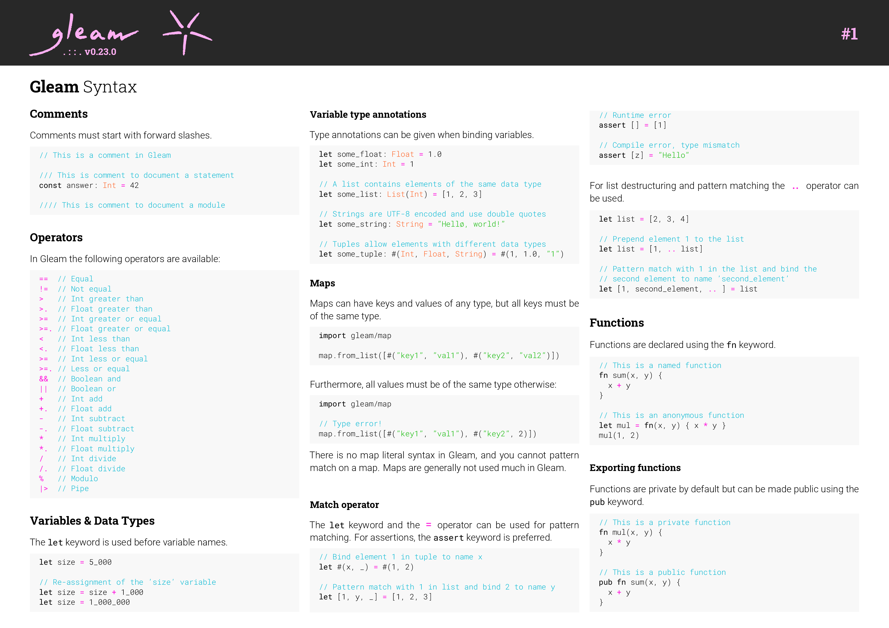
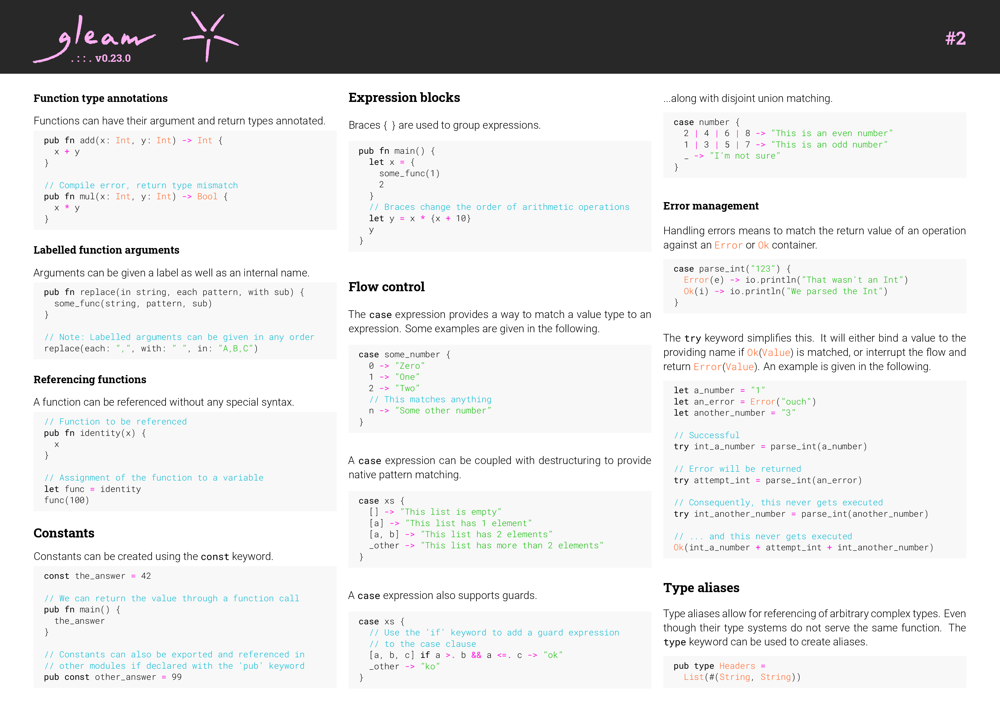
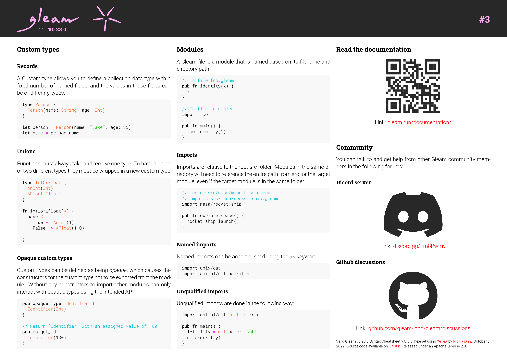

# Gleam Cheatsheets

A first attempt to turn the documentation found at [gleam.run/documentation](https://gleam.run/documentation) into nice printable cheatsheets.

## Preview 

<p align="center">
  
  
  
</p>


## Compiling the Cheatsheets

The cheatsheet can be compiled using a local installation of [XeLaTeX](https://tug.org/xetex/) or through Docker.

### Local XeLaTeX Installation

Assuming you have a _local_ installation of XeLaTeX go through the following steps: 

1. Enter into the directory containing the `main.tex` file

```bash
cd gleam_cheatsheets/v0.23.0
```

2. Compile the cheatsheet using XeLaTeX:

```bash
xelatex main.tex && xelatex main.tex
```

3. Create different sizes of the cheatsheet:

```bash
make all-sizes
```

### Docker

Assuming you have _Docker_ installed go through the following steps: 

1. Enter into the directory containing the `main.tex` file

```bash
cd gleam_cheatsheets/v0.23.0
```

2. Compile the cheatsheet using Docker and create different sizes of the cheatsheet:

```bash
docker build -t gleam_cheatsheet . && docker run --rm -v $(pwd):/data gleam_cheatsheet /bin/bash -c "xelatex main.tex && xelatex main.tex && make all-sizes"
```

## Development

Whenever the cheatsheets have been updated, update the previews as well:

```bash
gs -dSAFER -dQUIET -dNOPLATFONTS -dNOPAUSE -dBATCH -dNOTRANSPARENCY -sOutputFile="previews-%d.png" -sDEVICE=png16m -r300 -dTextAlphaBits=4 -dGraphicsAlphaBits=4 -dUseCIEColor -dUseTrimBox main.pdf && mv previews-* ../preview

```

## Acknowledgements

Most of the content currently contained in the cheatsheet comes from:
- The documentation found at [gleam.run/documentation](https://gleam.run/documentation)

The images used in the header of the cheatsheet comes from:
- The gleam website found on [github](https://github.com/gleam-lang/website/tree/main/img)
